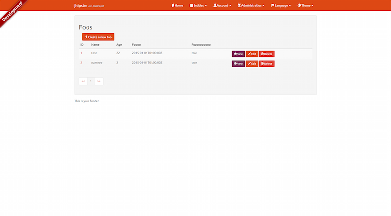

# テーマスイッチャでBootswatchのテーマを使用する

__このTipは[@deepu105](https://github.com/deepu105)から提出されました__

これは現在、[JHipsterモジュール](https://github.com/deepu105/generator-jhipster-bootswatch)として利用できますが、JHipsterバージョン2.26.2以降が必要です。

デフォルトのテーマの代わりに[Bootswatch](https://bootswatch.com/)テーマを使用するには、ブートストラップcssをbootswatchテーマのcssでオーバーライドする必要があります。ただし、Bootswatchのテーマを動的に切り替えるクールなテーマスイッチャが必要な場合は、このヒントに従ってください。

生成されたアプリケーションで次を変更します。

**注:**'yourApp'は、生成されたアプリケーション名に置き換えてください。

## ファイルの追加

次のサービスを`webapp/app/components/bootswatch`の下に`bootswatch.service.js`として追加します。

    'use strict';

    angular.module('yourApp')
        .factory('BootSwatchService', function ($http) {
            return {
                get: function() {
                    return $http.get('http://bootswatch.com/api/3.json').then(function (response) {
                        return response.data.themes;
                    });
                }
            };
        });

次のディレクティブを`webapp/app/components/bootswatch`の下に`bootswatch.directive.js`として追加します。

    'use strict';

    angular.module('yourApp')
        .directive('jhSwitchTheme', function() {
            /*Directive binds to anchor to update the bootswatch theme selected*/
            return {
                restrict: 'A',
                scope: {
                    theme : '=jhSwitchTheme'
                },
                link: function (scope, element, attrs) {
                    var currentTheme = $("#bootswatch-css").attr('title');
                    if(scope.theme.name === currentTheme){
                        element.parent().addClass("active");
                    }

                    element.on('click',function(){
                        $("#bootswatch-css").attr("href", scope.theme.css);
                        $(".theme-link").removeClass("active");
                        element.parent().addClass("active");
                    });
                }
            };
        });

次のコントローラを`webapp/app/components/bootswatch`の下に`bootswatch.controller.js`として追加します。

    'use strict';

    angular.module('yourApp')
        .controller('BootswatchController', function ($scope, BootSwatchService) {
            /*Get the list of availabel bootswatch themes*/
            BootSwatchService.get().then(function(themes) {
                $scope.themes = themes;
                $scope.themes.unshift({name:'Default',css:''});
            });
        });

## index.html

CSS vendor.css構築タスクの後の`index.html`ファイルに以下を追加して、これらが構築タスクによってminifyおよび圧縮されないようにします。

    <!-- build:css content/css/vendor.css -->

    ...

    <!-- endbuild -->
    <!-- bootswatchテーマを読み込むためのプレースホルダリンク。タイトルには、現在適用されているテーマ名が表示されます。-->
    <link rel="stylesheet" href="" id="bootswatch-css" title="Default">
    <!-- build:css assets/styles/main.css -->

    ...

    <!-- endbuild -->

Add the below in footer

    

        
This is your footer

        

            <a class="btn btn-default dropdown-toggle" data-toggle="dropdown">
                
                Theme
                <b class="caret"></b>
            </a>
            <ul class="dropdown-menu" role="menu">
                <li class="theme-link" ng-repeat="theme in themes">
                    
                    <a href="" jh-switch-theme="theme">{{theme.name}}</a>
                    
                </li>
            </ul>
        

    

'gulp inject'が失敗し、Angularエラーが発生した場合は、index.htmlファイルにスクリプトタグを手動で追加します。

    <!-- build:js({.tmp,src/main/webapp}) scripts/app.js -->

    ...

    
    
    

# app.js (oAuth/xAuthのみ)

OAuthまたはxAuthを使用している場合は、`app/blocks/interceptor/auth.interceptor.js`のauthInterceptorのbootswatch URLに除外を追加します。

    .factory('authInterceptor', function ($rootScope, $q, $location, localStorageService) {
        return {
            // ヘッダーに許可トークンを追加する
            request: function (config) {
                config.headers = config.headers || {};
                // bootswatchのURLを除外する
                if(config.url.indexOf('api.bootswatch.com') === -1){
                    var token = localStorageService.get('token');
                    ....
                }
                return config;
            }
        };

# Screenshots

